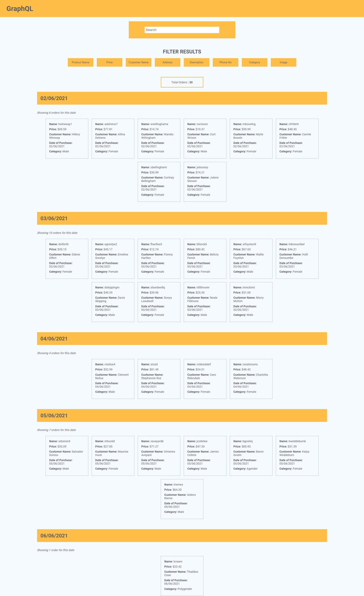

# React - Graphql

Fetching Product orders from server using Graphlql api with React JS



## Table of Content

- [Description](#description)
- [How to Install](#how-to-install)
  - [Server](#server)
  - [CLient](#client)
- [Technology](#technology)
- [Client-Side(React JS)](#client-side-react-js)
  - [Components](#components)
    - [App](#app)
    - [Home](#home)
    - [Search](#search)
    - [Filter](#filter)
    - [TotalCount](#totalcount)
    - [Section](#section)
  - [Query](#query)
  - [Context Api](#context-api)
- [Server-Side (Express JS)](#server-sideexpress-js)

## Description

These project enables a user to retrieve selected piece of information based on the users choice.

It separates the order received from ther server into five(5) different categories for easy scan throught by the user.

A user can click on different buttons to select what field he needs at the moment and can search through typeing into the input for specific search results.

## How to Install

To run this project, install it locally using npm and yarn:

#### Server

```
cd server

npm install

npm run dev

```

This will spin off a server on port 5000 on localhost where you can access the mock api

#### Client

```
cd client1

yarn install

yarn start

```

## Technology

- React JS for client side
- Graphql
- Apollo CLient for fetching data
- React Context for managing App state
- Express for creating a server with mock api
- express-graphql for middleware to intercept request

## CLIENT-SIDE (REACT JS)

### Components

#### APP

- Receives LOADING AND ERROR STATE
- If when app is making a Query to the server, the app is in LOADING \* STATE and displays LOADING...
- If an error occurs trying to fetch data, an ERROR STATE is displayed
- If data is successfully retrieved, the HOME component is rendered with the gotten data

#### HOME

- Renders different component to display data info
- SEARCH ===> Responsible for getting input and making a search query
- FILTER ===> Responsible for filtering Query from the server
- TOTALCOUNT ====> Responsible for displaying the total count from the fetch query
- Section ====> Responsible for filtering the query results into different sections by their date of purchase

### SEARCH

- Contains an input which recieves text input for search Query

### FILTER

- A group of buttons to make filtered query to the server
- Clicking a given button toggles the state of a filed to included in a query (TRUE/FALSE)

### TOTALCOUNT

- Shows total count of all the results returned from the Query

### SECTION

- Controls an internal state for deciding what data should be displayed
- Recieves a prop FILTER with PROPTYPE==> "PropTypes.string.isRequired"
- Uses the filter prop to filter the data by DATE
- Uses useEffect to update the component immediately to the desired data by filtering to get the orders made within the date specified in the filter prop

### QUERY

- Query to get orders from the server
- accepts variables for dynamic states and to set dynamic Argument with useState
- orders Query accepts a search arg and returns different fields depending on the allowed field
- This Query is able to dynamically decide which field is allowed by using the INCLUDE DIRECTIVE
- The INCLUDE DIRECTIVE depends on the state of the variables to return a field from the server

### CONTEXT API

- Maintains the App State of the App using REACT CONTEXT
- Returns VALUE which holds all the values in an object required by different components
- Returns SETFUNC an object which holds all the mutating functions for changing App state
- Returns LOADING,ERROR, DATA from the Query made from the USEQUERY hook

## SERVER-SIDE(EXPRESS JS)

- Order Schema
  - id: { type: GraphQLID }
  - customer_name: { type: GraphQLString }
  - category: { type: GraphQLString }
  - description: { type: GraphQLString }
  - date_of_purchase: { type: GraphQLString }
  - phone_no: { type: GraphQLString }
  - price: { type: GraphQLString }
  - product_name: { type: GraphQLString }
  - address: { type: GraphQLString }
  - image: { type: GraphQLString }
- Orders Schema
  - GraphQLList(OrderType)
